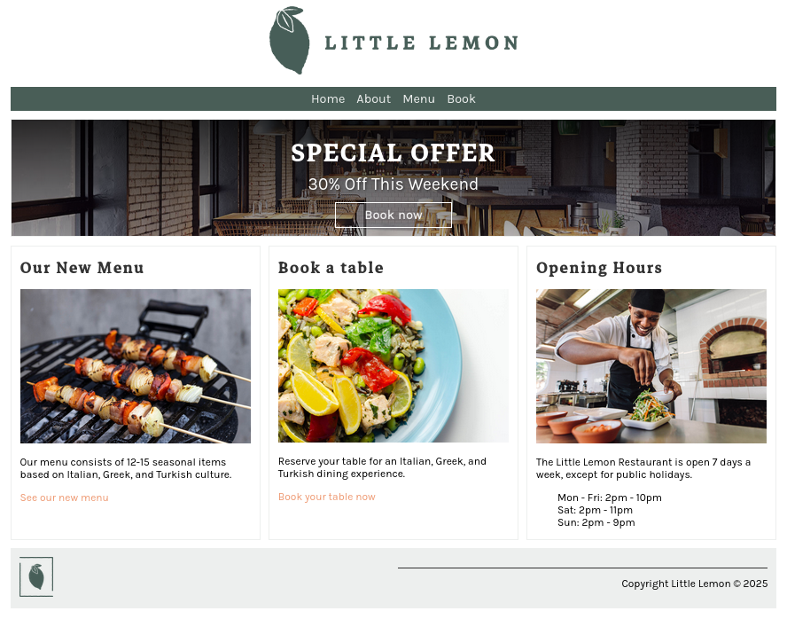
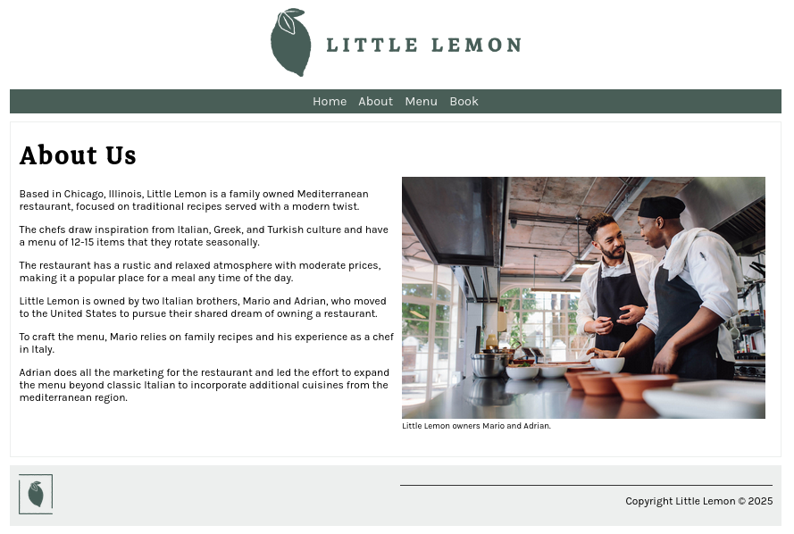
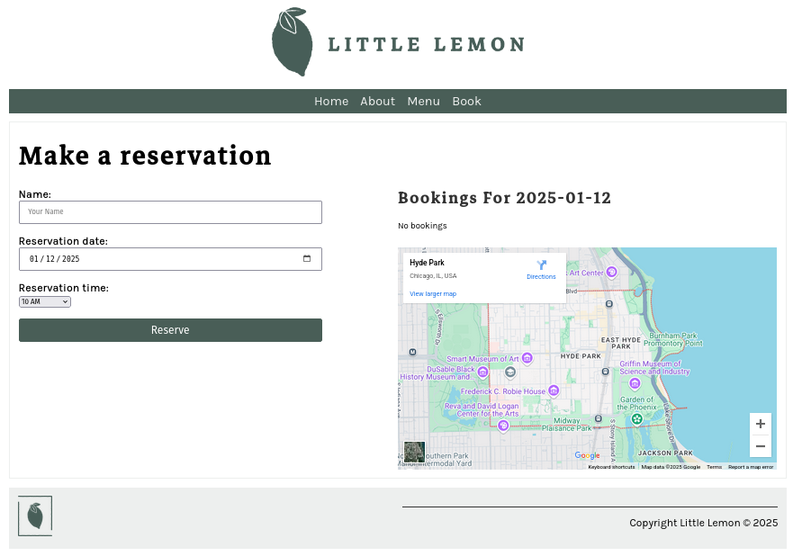
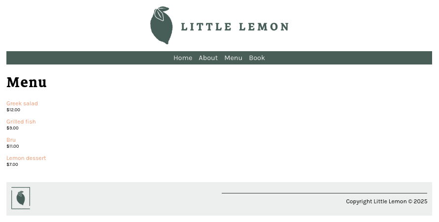
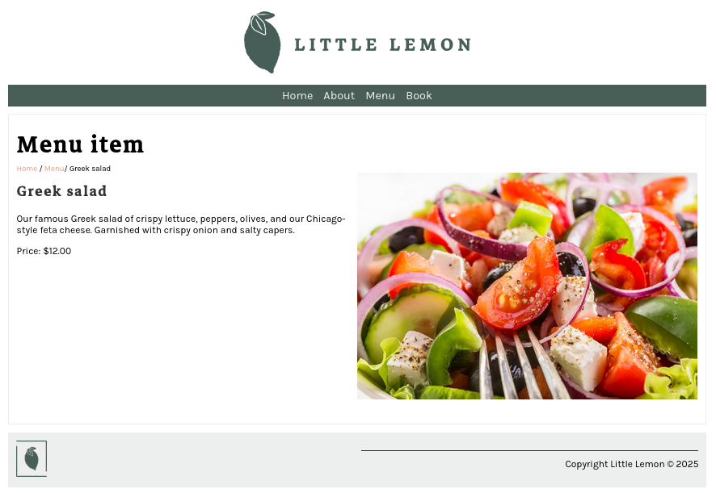
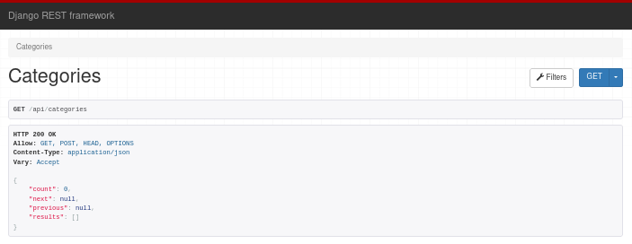
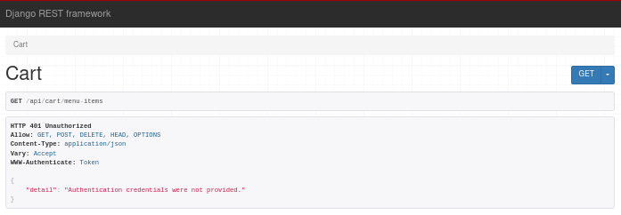
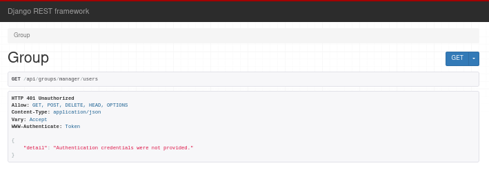
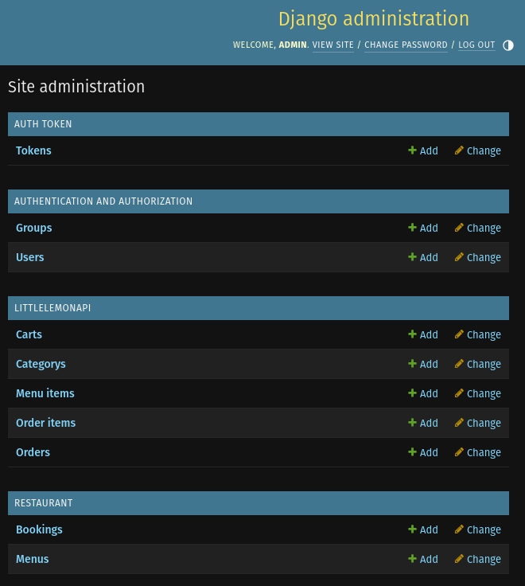

# Meta Back-End Developer Project - Little Lemon

Este projeto foi desenvolvido como parte do curso de **Desenvolvedor Web** da Meta. O site do **Little Lemon** oferece uma plataforma online completa para um restaurante, permitindo que os clientes naveguem por informações sobre o restaurante, façam reservas, visualizem o menu e obtenham detalhes dos pratos.

## Tecnologias Utilizadas

O projeto utiliza as seguintes tecnologias:

- **Django**: Framework Python para desenvolvimento web.
- **MySQL**: Banco de dados relacional para armazenar informações de usuários, reservas, pedidos e menu.
- **HTML**: Linguagem de marcação para estruturar as páginas web.
- **CSS**: Linguagem de estilização para o design visual do site.
- **JavaScript**: Para interatividade no frontend e funcionalidades dinâmicas.
- **Django Rest Framework**: Usado para criar a API RESTful do backend.

## Funcionalidades

O site inclui várias funcionalidades essenciais para o funcionamento de um restaurante:

- **Página Inicial (Home)**: Página de boas-vindas do bistrô com uma visão geral.
- **Sobre (About)**: Informações sobre a história do restaurante e sua missão.
- **Reservas (Reservations)**: Funcionalidade para o cliente realizar reservas para jantares ou eventos especiais.
- **Menu**: Exibe o cardápio do bistrô com informações detalhadas sobre os pratos.
- **Mapa Interativo**: Um mapa para o cliente encontrar a localização do restaurante.
- **Detalhes dos Pratos**: Acesso a uma página com mais informações sobre cada prato do menu.

### URLs do Site:

- `/` - Página inicial  

- `/about/` - Página sobre o restaurante  

- `/book/` - Página de reservas  

- `/bookings/` - Lista de reservas realizadas (admin)

- `/reservations/` - Confirmação de reservas (admin)

- `/menu/` - Menu do restaurante  

- `/menu_item/<int:pk>/` - Detalhes de um prato específico  

## Aplicação API

O projeto também inclui uma **API RESTful** para gerenciar o backend do site, com funcionalidades para controle de usuários, pedidos, carrinho de compras e integração com o banco de dados MySQL.

### Funcionalidades do Administrador
1. Atribuir usuários ao grupo de gerentes.
2. Adicionar itens ao menu.
3. Adicionar categorias.

### Funcionalidades do Gerente
4. Fazer login como gerente.
5. Atualizar o item do dia.
6. Atribuir usuários à equipe de entrega.
7. Atribuir pedidos à equipe de entrega.

### Funcionalidades da Equipe de Entrega
8. Acessar pedidos atribuídos a eles.
9. Atualizar um pedido como entregue.

### Funcionalidades do Cliente
10. Registrar-se como cliente.
11. Fazer login e obter tokens de acesso.
12. Navegar por todas as categorias.
13. Navegar por todos os itens do menu de uma vez.
14. Navegar por itens do menu por categoria.
15. Paginar itens do menu.
16. Ordenar itens do menu por preço.
17. Adicionar itens ao carrinho.
18. Acessar itens previamente adicionados ao carrinho.
19. Fazer pedidos.
20. Navegar por seus próprios pedidos.

### URLs da API:

- `/categories` - Exibe as categorias de itens no menu.  

- `/menu-items` - Exibe todos os itens do menu.

- `/menu-items/<int:pk>` - Exibe detalhes de um item específico do menu.

- `/cart/menu-items` - Gerencia os itens no carrinho de compras.  

- `/orders` - Gerencia os pedidos feitos pelos clientes.

- `/orders/<int:pk>` - Exibe detalhes de um pedido específico.

- `/groups/manager/users` - Gerencia os usuários do grupo de gerentes.  

- `/groups/delivery-crew/users` - Gerencia os usuários do grupo de equipe de entrega.

---

### Painel de administração Django  

---

## Licença

Este projeto é destinado a fins educacionais e não é indicado para uso em produção.

---
Desenvolvido por Felipe como parte do curso de Back-End da Meta.
# Certificação Meta Back-End Developer
